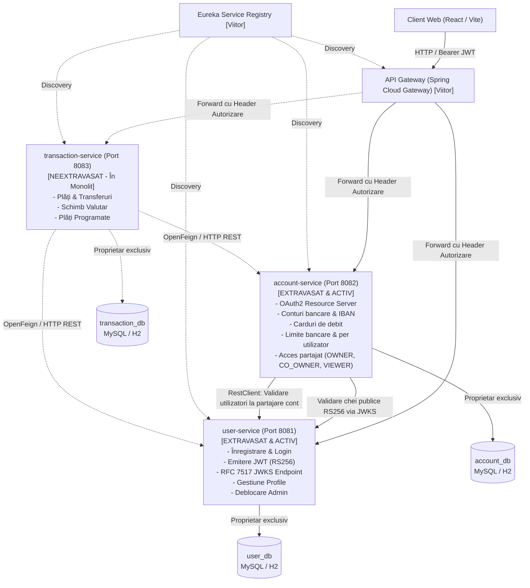

# Arhitectura de Microservicii – Internet Banking

Acest document descrie tranziția aplicației Internet Banking de la arhitectura monolită către un sistem distribuit bazat pe microservicii Spring Boot, cu accent pe independența serviciilor, izolarea bazelor de date și noul model de securitate distribuită.

---

## 1. Stadiul Curent al Tranziției

| Componentă / Serviciu | Port | Stare | Responsabilități & Ownership |
|---|---|---|---|
| **`monolith` (proiect)** | `8080` | **STABIL & ACTIV** | Aplicația monolită completă (conturi, plăți, carduri, tranzacții, sesiuni, CSRF). Reprezentată de tag-ul git `monolith-stable`. 219 teste trecute. |
| **`user-service`** | `8081` | **EXTRAVASAT & ACTIV (Faza 1)** | Gestiune utilizatori, profiluri persoane fizice, autentificare JWT RS256, expunere endpoint RFC 7517 JWKS (`/.well-known/jwks.json`), hashing BCrypt, contor eșecuri, blocare/deblocare admin. Deține exclusiv baza de date `user_db`. 21 teste trecute, ~86% acoperire JaCoCo. |
| **`account-service`** | `8082` | **EXTRAVASAT & ACTIV (Faza 2)** | Gestiune conturi curente, acces partajat multi-user (`OWNER`, `CO_OWNER`, `VIEWER`), emitere și administrare carduri, limite tranzacționale (bancă + utilizator cu fallback). OAuth2 Resource Server RS256. Deține exclusiv baza de date `account_db`. 37 teste trecute, ~80% acoperire JaCoCo. |
| **`transaction-service`** | `8083` | **NEEXTRAVASAT (Planificat - Faza 3)** | Plăți standard/urgente, transferuri proprii, plăți programate, schimb valutar, categorii. Momentan deservit de monolit. |
| **`api-gateway`** | `8080/80` | **NEEXTRAVASAT (Planificat - Faza 4)** | Punct unic de intrare (Spring Cloud Gateway), rutare, validare JWT, rate limiting. |
| **`eureka-server`** | `8761` | **NEEXTRAVASAT (Planificat - Faza 4)** | Service Discovery & Registry pentru înregistrarea dinamică a microserviciilor. |

---

## 2. Diagrama Arhitecturală Țintă

---

## 3. Securitate: Monolit vs. Arhitectură Distribuită

### Monolitul (`proiect`)
- **Autentificare:** Pe bază de sesiune HTTP pe server (`SecurityContextHolder`, `HttpSessionSecurityContextRepository`).
- **Identificator:** Cookie de sesiune ambient `JSESSIONID`.
- **Remember Me:** `TokenBasedRememberMeServices` cu cookie securizat `remember-me` (14 zile).
- **Protecție CSRF:** **Obligatorie.** Monolitul folosește `CookieCsrfTokenRepository` cu mecanism Double Submit Cookie (`XSRF-TOKEN` cookie + antetul `X-XSRF-TOKEN`). Este strict necesară deoarece browserul trimite automat cookie-urile (`JSESSIONID`) la cererile cross-origin.

### Microserviciile Distribuite (`user-service` și `account-service`)
- **Autentificare:** Stateless Bearer Token conform standardului OAuth2 Resource Server.
- **Identificator:** JSON Web Token (JWT) semnat asimetric cu **RS256** (RSA 2048 biți).
- **Issuer:** `user-service` emite token-urile și expune cheia publică la `GET /.well-known/jwks.json`.
- **Resource Server:** `account-service` acționează ca OAuth2 Resource Server, consumând JWKS sau cheia publică și decodând token-urile stateless fără acces la baza de date a `user-service`.
- **Transmitere:** Antetul HTTP standard: `Authorization: Bearer <token>`.
- **Claims incluse în JWT:**
  - `iss`: `"user-service"`
  - `sub`: email-ul utilizatorului
  - `userId`: ID-ul unic al utilizatorului
  - `username`: numele de utilizator
  - `role`: rolul de securitate (`USER` sau `ADMIN`)
  - `iat`: momentul emiterii
  - `exp`: momentul expirării (2 ore / 7200 secunde)
- **Politica de confidențialitate a claim-urilor:** **Niciun câmp sensibil nu este inclus în JWT** (fără parole, fără hash-uri BCrypt, fără CNP, fără numere de telefon sau date financiare).
- **Protecție CSRF:** **Dezactivată intenționat (`csrf.disable()`).**
  > **De ce este CSRF dezactivat în microservicii dar activ în monolit?**  
  > Atacurile de tip Cross-Site Request Forgery (CSRF) se bazează pe trimiterea automată de către browser a cookie-urilor de sesiune în cererile cross-site. Microserviciile nu folosesc sesiuni sau cookie-uri de autentificare; fiecare cerere protejată necesită un antet HTTP explicit `Authorization: Bearer <token>`, pe care browserele nu îl atașează niciodată automat în scenarii cross-origin. Prin urmare, atacul CSRF este imposibil structural pe un API REST bazat pe token Bearer.

---

## 4. Izolarea Datelor și Bounded Contexts

Fiecare microserviciu deține în mod suveran schema de bază de date proprie. Niciun microserviciu nu are permisiunea de a executa interogări SQL directe sau join-uri pe tabelele altui serviciu:

### `user_db` (Deținut exclusiv de `user-service`)
- **Tabele:** `users`, `individuals`.
- **Relații interne:** `User` ↔ `Individual` (1:1).
- **Acces extern:** Strict prin API-ul REST al `user-service`:
  - `GET /api/users/{id}`: Furnizează DTO-ul sigur `UserLookupDTO` (`userId`, `username`, `email`, `role`, `enabled`). Fără expunerea hash-ului de parolă sau a CNP-ului.
  - `GET /api/users/by-email?email=...`: Căutare sigură inter-servicii după email.

### `account_db` (Deținut exclusiv de `account-service`)
- **Tabele:** `accounts`, `account_access`, `cards`, `bank_limits`, `user_limits`.
- **Izolare față de User:** Nu există relații JPA `@ManyToOne User user` sau chei străine către tabelele din `user_db`. Utilizatorul este referențiat exclusiv ca identificator scalar `Integer userId` în `account_access` și `user_limits`.
- **Matricea de acces la cont:**
  - `OWNER`: Acces deplin (interogare, inițiere operațiuni, emitere/ștergere carduri, închidere cont).
  - `CO_OWNER`: Acces operațional (interogare, emitere card propriu, inițiere tranzacții; fără drept de închidere sau ștergere definitivă).
  - `VIEWER`: Acces strict de citire (read-only; interzise emiterea de carduri, tranzacțiile sau închiderea).
- **Concurrency & Monedă:**
  - Soldul este modelat cu `BigDecimal` (precizie 19, scară 4).
  - Blocare optimistă implementată prin `@Version private Long version;` pe entitatea `Account`.

---

## 5. Catalog API – Microservicii

### `user-service` (Port 8081)

| Metodă | Endpoint | Autorizare | Rol | Corp Cerere / Parametri | Răspuns | Descriere |
|---|---|---|---|---|---|---|
| `GET` | `/.well-known/jwks.json` | Anonim | Oricine | - | `200 OK` (RFC 7517 JWKSet) | Cheile publice RSA pentru validarea asimetrică a token-urilor RS256 |
| `POST` | `/api/auth/validate-individual` | Anonim | Oricine | `IndividualRegistrationDTO` | `200 OK` / `400 Bad Request` | Validează CNP unic, vârstă minimă 18 ani și câmpuri obligatorii |
| `POST` | `/api/auth/register` | Anonim | Oricine | `RegistrationRequestDTO` | `201 Created` / `400 Bad Request` | Înregistrează persoana fizică și utilizatorul cu parolă hashuită BCrypt |
| `POST` | `/api/auth/login` | Anonim | Oricine | `LoginRequestDTO` | `200 OK` (`LoginResponseDTO` cu JWT) | Autentifică credențialele, gestionează eșecurile/blocarea și emite tokenul JWT |
| `GET` | `/api/users/me` | Bearer JWT | `USER` / `ADMIN` | - | `200 OK` (`UserResponseDTO`) | Returnează profilul utilizatorului curent din tokenul JWT |
| `GET` | `/api/users/{id}` | Bearer JWT | `USER` / `ADMIN` | - | `200 OK` (`UserLookupDTO`) / `404` | Lookup sigur de utilizator pentru comunicare inter-servicii |
| `GET` | `/api/users/by-email` | Bearer JWT | `USER` / `ADMIN` | `email` (query param) | `200 OK` (`UserLookupDTO`) / `404` | Căutare sigură de utilizator după email |
| `PUT` | `/api/admin/users/{id}/unlock` | Bearer JWT | **`ADMIN`** | - | `200 OK` / `403 Forbidden` / `404` | Deblochează contul utilizatorului blocat după 3 încercări eșuate |
| `POST` | `/api/admin/unlock-user` | Bearer JWT | **`ADMIN`** | `email` (query param) | `200 OK` / `403 Forbidden` / `404` | Deblochează utilizatorul specificat prin email |

### `account-service` (Port 8082)

| Metodă | Endpoint | Autorizare | Rol Permis | Corp / Parametri | Răspuns | Descriere |
|---|---|---|---|---|---|---|
| `GET` | `/api/accounts` | Bearer JWT | Oricine autentificat | - | `200 OK` (`List<AccountSummaryDTO>`) | Returnează conturile accesibile utilizatorului curent (cu rolul de acces) |
| `GET` | `/api/accounts/{id}` | Bearer JWT | `OWNER`, `CO_OWNER`, `VIEWER` | - | `200 OK` (`AccountDetailsDTO`) / `403` / `404` | Returnează detaliile contului dacă utilizatorul are acces activ |
| `POST` | `/api/accounts` | Bearer JWT | Oricine autentificat | `CreateSingleAccountRequestDTO` | `201 Created` (`AccountResponseDTO`) | Creează cont nou (utilizatorul devine OWNER, IBAN unic generat, sold inițial) |
| `PUT` | `/api/accounts/{id}/close` | Bearer JWT | Doar `OWNER` | - | `200 OK` / `400` (sold > 0) / `403` | Închide contul dacă soldul este 0 și utilizatorul este OWNER |
| `GET` | `/api/accounts/paged` | Bearer JWT | Oricine autentificat | `page`, `size`, `sortBy`, `direction` | `200 OK` (`PageResponseDTO`) | Returnează conturile paginate ale utilizatorului curent |
| `GET` | `/api/accounts/summary/currency` | Bearer JWT | Oricine autentificat | - | `200 OK` (`List<AccountCurrencySummaryDTO>`) | Agregare solduri și număr conturi per valută |
| `GET` | `/api/accounts/{id}/cards` | Bearer JWT | `OWNER`, `CO_OWNER`, `VIEWER` | - | `200 OK` (`List<CardResponseDTO>`) | Lista cardurilor atașate contului |
| `POST` | `/api/accounts/{id}/cards` | Bearer JWT | `OWNER`, `CO_OWNER` | - | `201 Created` (`CardResponseDTO`) | Emite card nou de debit (16 cifre, CVV, 3 ani expirare) |
| `PATCH` | `/api/accounts/{accId}/cards/{cId}/status/{st}` | Bearer JWT | `OWNER`, `CO_OWNER` | `status` (ACTIVE, BLOCKED, CLOSED) | `200 OK` / `400` / `403` | Schimbă statusul cardului |
| `DELETE` | `/api/accounts/{accId}/cards/{cId}` | Bearer JWT | Doar `OWNER` | - | `204 No Content` / `403` / `404` | Șterge/anulează cardul din cont |
| `GET` | `/api/limits/me` | Bearer JWT | Oricine autentificat | - | `200 OK` (`UserLimitResponseDTO`) | Limitele utilizatorului curent (cu fallback automat pe limitele băncii) |
| `PUT` | `/api/limits/me` | Bearer JWT | Oricine autentificat | `UserLimitRequestDTO` | `200 OK` / `400 Bad Request` | Actualizează limitele (nu pot depăși limitele maxime ale băncii) |
| `DELETE` | `/api/limits/me` | Bearer JWT | Oricine autentificat | - | `204 No Content` | Resetează limitele utilizatorului la cele implicite ale băncii |
| `GET` | `/api/admin/bank-limits` | Bearer JWT | Doar **`ADMIN`** | - | `200 OK` (`BankLimitResponseDTO`) / `403` | Limitele globale ale băncii |
| `PUT` | `/api/admin/bank-limits` | Bearer JWT | Doar **`ADMIN`** | `BankLimitRequestDTO` | `200 OK` / `400` / `403` | Actualizează limitele globale ale băncii |
| `DELETE` | `/api/admin/bank-limits/{id}` | Bearer JWT | Doar **`ADMIN`** | - | `204 No Content` / `403` | Șterge o configurare de limită bancară |
| `POST` | `/api/admin/accounts/shared` | Bearer JWT | Doar **`ADMIN`** | `SharedAccountRequest` | `201 Created` / `400` / `404` | Partajează cont între max 2 utilizatori validați via `user-service` |
| `DELETE` | `/api/admin/accounts/{accId}/access` | Bearer JWT | Doar **`ADMIN`** | `email` (query param) | `204 No Content` / `404` | Revocă accesul unui utilizator la contul specificat |
