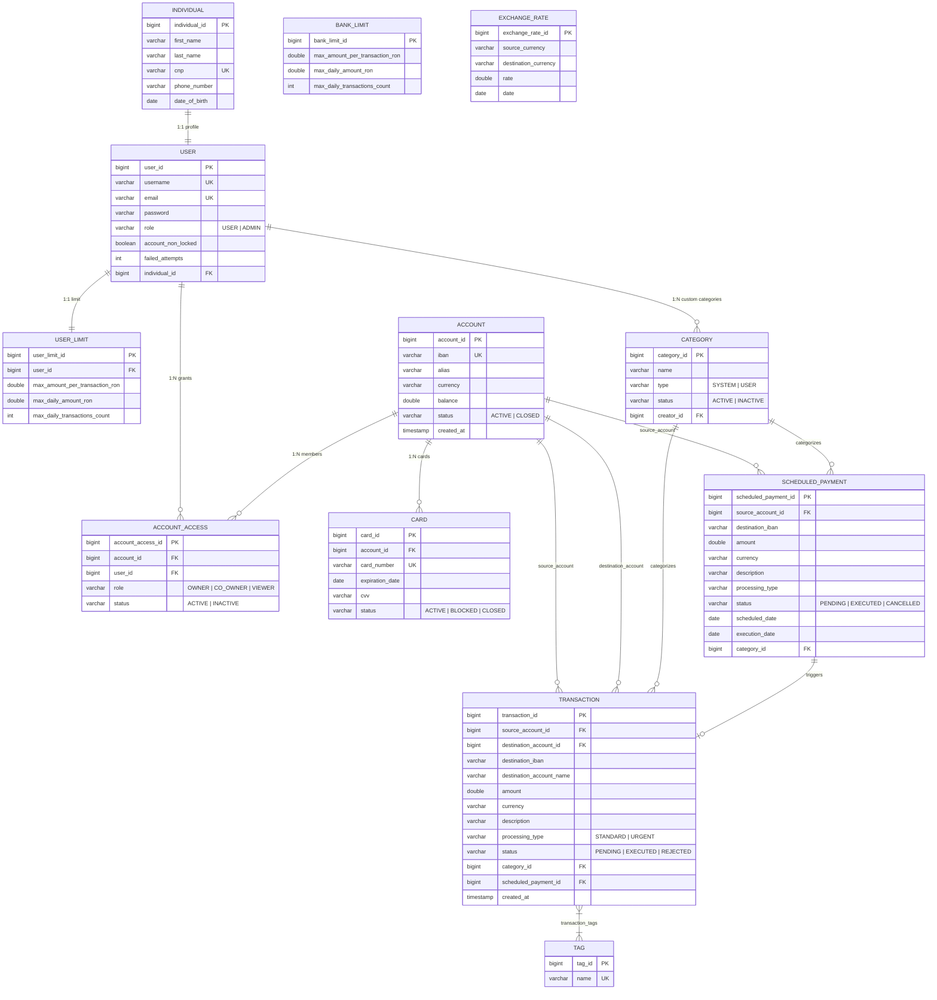

# Internet Banking Application

O aplicație web completă de tip Internet Banking destinată persoanelor fizice, dezvoltată pe o arhitectură modernă cu backend **Spring Boot 4 / Java 25** și frontend **React / Vite**. Sistemul modelează fluxurile financiare reale: administrare conturi curente, emitere și blocare carduri, transferuri între conturi proprii, schimb valutar cu parități de schimb, plăți interbancare urgente și standard, programare plăți recurente, configurare limite bancare și de utilizator, clasificare cheltuieli pe categorii și gestiune conturi partajate (multi-user).

---

## Cuprins

1. [Arhitectură și Tehnologii](#1-arhitectură-și-tehnologii)
2. [Modelul de Date și Diagrama ER](#2-modelul-de-date-și-diagrama-er)
3. [Securitate și Autorizare](#3-securitate-și-autorizare)
   - [Autentificare pe bază de sesiune](#autentificare-pe-bază-de-sesiune)
   - [Protecție CSRF (Double Submit Cookie)](#protecție-csrf-double-submit-cookie)
   - [Remember Me](#remember-me)
   - [Autorizare resurse la nivel de sesiune (Prevenire IDOR)](#autorizare-resurse-la-nivel-de-sesiune-prevenire-idor)
   - [Roluri și Ierarhie (USER vs ADMIN)](#roluri-și-ierarhie-user-vs-admin)
   - [Validare date și Tratare Erori (HTTP 400, 401, 403, 404, 405, 500)](#validare-date-și-tratare-erori)
4. [Catalog API REST](#4-catalog-api-rest)
5. [Profiluri de Configurare și Bază de Date](#5-profiluri-de-configurare-și-bază-de-date)
6. [Ghid de Rulare și Testare](#6-ghid-de-rulare-și-testare)
   - [Backend (Gradle)](#backend-gradle)
   - [Frontend (npm / Vite)](#frontend-npm--vite)
   - [Teste End-to-End (Playwright)](#teste-end-to-end-playwright)
7. [Metrici de Testare și Raport JaCoCo](#7-metrici-de-testare-și-raport-jacoco)
8. [Stadiul Proiectului și Pași Următori](#8-stadiul-proiectului-și-pași-următori)

---

## 1. Arhitectură și Tehnologii

Aplicația este structurată în două module principale:

### Backend (`/proiect`)
- **Framework:** Spring Boot 4.0.0-M2 cu Java 25 (OpenJDK 25).
- **Securitate:** Spring Security 7 (filtre de securitate, `DaoAuthenticationProvider`, `TokenBasedRememberMeServices`, `CookieCsrfTokenRepository`).
- **Persistență:** Spring Data JPA cu Hibernate ORM, suport multi-dialect (H2 in-memory, MySQL).
- **Validare:** Jakarta Bean Validation (`@NotBlank`, `@NotNull`, `@Size`, `@DecimalMin`, `@Pattern`, `@Valid`).
- **Mapare:** MapStruct și mappere manuale cu filtrare a datelor private în funcție de identitatea apelantului.
- **Task Scheduling:** Spring `@Scheduled` pentru procesarea automată a plăților programate și actualizarea cursurilor valutare.
- **Testare:** JUnit 5, Mockito, Spring Security Test, MockMvc, JaCoCo.

### Frontend (`/proiect/frontend`)
- **Framework:** React 18, React Router v6.
- **Build Tool:** Vite.
- **Client HTTP:** Modul custom nativ `apiFetch` cu gestionare automată a sincronizării CSRF, credențialelor HTTP (`credentials: 'include'`) și tratarea unitară a erorilor.
- **UI & Reziliență:** Componente modulare, stilizare CSS responsive, `ErrorBoundary` pentru capturarea erorilor neprevăzute în UI, pagină dedicată `NotFoundPage` (404).
- **Testare:** Node.js test runner nativ (`node --test`), Playwright pentru teste E2E multi-browser (Microsoft Edge / Chromium headless).

---

## 2. Modelul de Date și Diagrama ER

Sistemul persistă **12 entități JPA**, reflectând relații complexe:
- **`@OneToOne`**: `User` ↔ `Individual`, `User` ↔ `UserLimit`, `Transaction` ↔ `ScheduledPayment`.
- **`@OneToMany` / `@ManyToOne`**: `User` ↔ `AccountAccess`, `Account` ↔ `AccountAccess`, `Account` ↔ `Card`, `User` ↔ `Category` (creator), `Account` ↔ `Transaction` (source/destination), `Category` ↔ `Transaction`, `Account` ↔ `ScheduledPayment`, `Category` ↔ `ScheduledPayment`.
- **`@ManyToMany`**: `Transaction` ↔ `Tag` (tabela de legătură `transaction_tags`).

### Diagrama Entitate-Relație (Mermaid)



---

## 3. Securitate și Autorizare

Sistemul implementează un nivel robust de securitate în conformitate cu standardele OWASP și cerințele de reglementare bancară:

### Autentificare pe bază de sesiune
- Autentificarea se realizează la `POST /api/auth/login` cu verificare de credențiale prin `DaoAuthenticationProvider` și parolă hashuită cu `BCryptPasswordEncoder`.
- La autentificare reușită, se generează o sesiune HTTP nouă (`JSESSIONID`) cu protecție împotriva session fixation (`changeSessionId()`).
- Conturile sunt blocate automat după 3 încercări eșuate consecutive de login (`accountNonLocked = false`). Deblocarea poate fi executată doar de un `ADMIN`.

### Protecție CSRF (Double Submit Cookie)
- Utilizarea `CookieCsrfTokenRepository` cu `HttpOnly = false` pentru a permite clientului citirea cookie-ului `XSRF-TOKEN`.
- Clientul frontend obține un token sincronizat prin `GET /api/csrf` și îl include în antetul `X-XSRF-TOKEN` la orice operație de mutație (`POST`, `PUT`, `PATCH`, `DELETE`).
- În `apiFetch`, cererile CSRF concurente sunt comasate într-o singură promisiune pentru eficiență.

### Remember Me
- Configurat prin `TokenBasedRememberMeServices` cu o durată de valabilitate de **14 zile** (1.209.600 secunde).
- La login, utilizatorul poate bifa opțiunea *"Ține-mă minte (Remember Me)"*, transmițând câmpul `rememberMe: true` în `LoginRequestDTO`.
- Serverul setează cookie-ul securizat `remember-me`. La expirarea sau ștergerea cookie-ului `JSESSIONID`, filtrul `RememberMeAuthenticationFilter` auto-autentifică utilizatorul la orice cerere ulterioară.
- La logout (`POST /api/auth/logout`), ambele cookie-uri (`JSESSIONID` și `remember-me`) sunt invalidate și șterse din browser.

### Autorizare resurse la nivel de sesiune (Prevenire IDOR)
- **`CurrentUserService`**: Extrage identitatea utilizatorului exclusiv din `SecurityContextHolder`. Respinge identitățile anonime cu `401 Unauthorized` și utilizatorii absenți/blocați în baza de date cu `403 Forbidden`.
- **`ResourceAuthorizationService`**: Interceptare obligatorie în controller-e înainte de apelul serviciilor de business.
  - Verifică existența resursei în DB (`404 Not Found` dacă lipsește).
  - Verifică relația `AccountAccess` cu stare `ACTIVE`:
    - **READ**: Permis rolurilor `OWNER`, `CO_OWNER`, `VIEWER`.
    - **PAY**: Permis exclusiv rolurilor `OWNER`, `CO_OWNER`.
    - **ADMINISTER / CLOSE**: Permis exclusiv rolului `OWNER`.
  - Orice tentativă a utilizatorului A de a accesa sau manipula conturile, cardurile, limitele sau categoriile utilizatorului B returnează strict **`403 Forbidden`**.
  - Administratorii (`ADMIN`) nu pot ocoli regulile de ownership pentru a manipula date personale ale utilizatorilor pe endpoint-urile personale.

### Roluri și Ierarhie (USER vs ADMIN)
- **`ROLE_USER`**: Acces la operațiuni curente proprii (conturi, plăți, carduri, categorii, limite).
- **`ROLE_ADMIN`**: Acces exclusiv la `/api/admin/**` (configurare limite globale bancare, deblocare conturi, creare conturi multi-user partajate, revocare acces). Utilizatorii `USER` care accesează rutele administrative primesc `403 Forbidden`.

### Validare date și Tratare Erori
- Toate DTO-urile de intrare sunt adnotate cu Bean Validation (`@Valid`): `@NotBlank`, `@Size`, `@Pattern`, `@DecimalMin`, `@NotNull`.
- **`GlobalExceptionHandler`** garantează răspunsuri HTTP conforme:
  - **`400 Bad Request`**: Erori de validare Bean Validation, JSON nevalid, argumente ilegale (`{"error": "Campurile furnizate sunt invalide", "details": [...]}`).
  - **`401 Unauthorized`**: Cereri neautentificate către resurse protejate.
  - **`403 Forbidden`**: Încălcări de securitate, acces cross-user (IDOR), lipsă drepturi de rol.
  - **`404 Not Found`**: Rute inexistente, resurse DB absente (`{"error": "Resursa nu a fost gasita"}`).
  - **`405 Method Not Allowed`**: Metodă HTTP nepermisă pe ruta respectivă.
  - **`500 Internal Server Error`**: Excepții neprevăzute, cu mesaj prietenos și fără expunere de stacktrace intern (`{"error": "A aparut o eroare neasteptata. Va rugam incercati din nou."}`).

---

## 4. Catalog API REST

| Metodă | Endpoint | Rol / Autorizare | Body / Parametri | Status | Descriere |
|---|---|---|---|---|---|
| `GET` | `/api/csrf` | Anonim | - | 200 | Obține tokenul CSRF și setează cookie `XSRF-TOKEN` |
| `POST` | `/api/auth/validate-individual` | Anonim | `IndividualDTO` | 200, 400 | Verifică validitatea datelor persoanei fizice (CNP, vârstă) |
| `POST` | `/api/auth/register` | Anonim | `RegisterRequestDTO` | 200, 400 | Înregistrează persoană fizică și utilizator cu parolă BCrypt |
| `POST` | `/api/auth/login` | Anonim | `LoginRequestDTO` (cu `rememberMe`) | 200, 400, 401, 403 | Autentifică utilizatorul, creează sesiune și opțional token Remember Me |
| `POST` | `/api/auth/logout` | Autentificat | - | 200, 401 | Distruge sesiunea și șterge cookie-urile `JSESSIONID` și `remember-me` |
| `GET` | `/api/accounts` | USER / ADMIN | - | 200, 401 | Returnează conturile active ale utilizatorului din sesiune |
| `GET` | `/api/accounts/paged` | USER / ADMIN | `page`, `size`, `sort`, `direction` | 200, 401 | Returnează conturile paginat |
| `GET` | `/api/accounts/{accountId}` | READ pe cont | - | 200, 401, 403, 404 | Detalii cont (permis doar dacă utilizatorul are acces activ) |
| `POST` | `/api/accounts` | USER / ADMIN | `CreateAccountDTO` | 201, 400, 401 | Creează un cont nou pentru utilizatorul din sesiune |
| `PUT` | `/api/accounts/{accountId}/close` | OWNER pe cont | - | 200, 400, 401, 403, 404 | Închide contul (doar OWNER, soldul trebuie să fie 0) |
| `GET` | `/api/accounts/summary/currency` | USER / ADMIN | - | 200, 401 | Solduri agregate grupate pe monede |
| `GET` | `/api/transactions/user` | USER / ADMIN | `page`, `size`, `sort`, `direction` | 200, 401 | Tranzacțiile conturilor proprii paginat |
| `GET` | `/api/transactions/account/{accountId}` | READ pe cont | `page`, `size`, `sort`, `direction` | 200, 401, 403, 404 | Tranzacțiile unui cont specific |
| `POST` | `/api/payments/initiate` | PAY pe sursă | `PaymentRequestDTO` | 200, 400, 401, 403, 404 | Inițiază plată (verificare sold, parolă, limite bancare/utilizator) |
| `POST` | `/api/payments/transfer-own` | PAY sursă + READ dest. | `TransferOwnDTO` | 200, 400, 401, 403, 404 | Transfer între două conturi proprii ale aceluiași utilizator |
| `POST` | `/api/payments/exchange` | PAY sursă + READ dest. | `ExchangeDTO` | 200, 400, 401, 403, 404 | Schimb valutar între conturi proprii de monede diferite |
| `POST` | `/api/users/me/accounts/{accId}/card` | OWNER pe cont | - | 201, 401, 403, 404 | Emite un card de debit asociat contului |
| `GET` | `/api/users/me/accounts/{accId}/card` | READ pe cont | - | 200, 401, 403, 404 | Vizualizează cardul asociat contului |
| `PATCH` | `/api/users/me/accounts/{accId}/card/{cId}/status/{st}` | OWNER pe cont | - | 200, 400, 401, 403, 404 | Schimbă starea cardului (`ACTIVE`, `BLOCKED`) |
| `DELETE` | `/api/users/me/accounts/{accId}/card/{cId}/delete` | OWNER pe cont | - | 200, 401, 403, 404 | Închide definitiv cardul (`status = CLOSED`) |
| `GET` | `/api/users/me/categories` | USER / ADMIN | - | 200, 401 | Categorii active (sistem + proprii utilizatorului) |
| `GET` | `/api/users/me/categories/paged` | USER / ADMIN | `page`, `size`, `sort`, `direction` | 200, 401 | Categorii paginat |
| `POST` | `/api/users/me/categories` | USER / ADMIN | `CategoryRequestDTO` | 201, 400, 401 | Creează categorie privată custom |
| `GET` | `/api/users/me/categories/{catId}` | Vizibilitate cat. | - | 200, 401, 403, 404 | Detalii categorie |
| `PUT` | `/api/users/me/categories/{catId}` | Creator categorie | `CategoryRequestDTO` | 200, 400, 401, 403, 404 | Modifică o categorie privată proprie |
| `DELETE` | `/api/users/me/categories/{catId}` | Creator categorie | - | 200, 401, 403, 404 | Dezactivează categoria (`status = INACTIVE`) |
| `GET` | `/api/user/me/limits` | USER / ADMIN | - | 200, 401 | Vizualizează limitele tranzacționale personale |
| `PUT` | `/api/user/me/limits` | USER / ADMIN | `UserLimitRequestDTO` | 200, 400, 401 | Actualizează limitele personale (în limita celor globale bancare) |
| `DELETE` | `/api/user/me/limits` | USER / ADMIN | - | 200, 401 | Resetează limitele personale la valorile implicite |
| `GET` | `/api/admin/bank-limits` | ADMIN | - | 200, 401, 403 | Limitele globale bancare |
| `PUT` | `/api/admin/bank-limits` | ADMIN | `BankLimitDTO` | 200, 400, 401, 403 | Modifică limitele globale bancare |
| `DELETE` | `/api/admin/bank-limits/{id}` | ADMIN | - | 200, 401, 403, 404 | Șterge/resetează limită bancară |
| `PUT` | `/api/admin/users/{userId}/unlock` | ADMIN | - | 200, 401, 403, 404 | Deblochează utilizator blocat după încercări eșuate |
| `POST` | `/api/admin/unlock-user` | ADMIN | `email` (query param) | 200, 401, 403, 404 | Deblochează utilizator specificat prin email |
| `POST` | `/api/admin/create-shared-account` | ADMIN | `SharedAccountRequest` | 201, 400, 401, 403 | Creează cont partajat multi-user (OWNER, CO_OWNER, VIEWER) |
| `DELETE` | `/api/admin/accounts/{accId}/access` | ADMIN | `email` (query param) | 200, 400, 401, 403, 404 | Revocă accesul unui utilizator din contul partajat |

---

## 5. Profiluri de Configurare și Bază de Date

Aplicația oferă trei profiluri Spring configurate:

1. **`test` (`application-test.properties`):**
   - Bază de date in-memory H2: `jdbc:h2:mem:testdb`.
   - Dialect: `org.hibernate.dialect.H2Dialect`.
   - Generare automată a schemei: `spring.jpa.hibernate.ddl-auto=create-drop`.
   - Încărcare automată date de test: `data-test.sql` (conține utilizator admin și limite bancare inițiale).
   - Folosit pentru suita automată de teste JUnit și testele Playwright E2E.

2. **`dev` (`application-dev.properties`):**
   - Bază de date MySQL locală: `jdbc:mysql://localhost:3306/awbd_dev`.
   - Utilizator / parolă: `awbd` / `awbd`.
   - Validare schemă: `spring.jpa.hibernate.ddl-auto=validate`.

3. **`prod` (`application-prod.properties`):**
   - Bază de date MySQL producție: `jdbc:mysql://localhost:3306/awbd_prod`.
   - Utilizator / parolă: `awbd` / `awbd`.
   - Validare strictă a schemei, fără inițializări de test.

---

## 6. Ghid de Rulare și Testare

### Backend (Gradle)

1. **Rularea suitei complete de teste:**
   ```bash
   cd proiect
   .\gradlew.bat clean test
   ```

2. **Generare raport JaCoCo și build JAR:**
   ```bash
   .\gradlew.bat clean test jacocoTestReport build
   ```
   Rapoartele generate sunt disponibile la:
   - Raport teste: `proiect/build/reports/tests/test/index.html`
   - Raport acoperire JaCoCo: `proiect/build/reports/jacoco/test/html/index.html`

3. **Pornire server backend în mod test (H2 cu date inițiale):**
   ```bash
   .\gradlew.bat bootRun --args="--spring.profiles.active=test --spring.sql.init.mode=always"
   ```
   Serverul pornește pe `http://localhost:8080`.

### Frontend (npm / Vite)

1. **Instalare dependențe:**
   ```bash
   cd proiect/frontend
   npm install
   ```

2. **Verificare cod cu ESLint:**
   ```bash
   npm run lint
   ```

3. **Rulare teste unitare:**
   ```bash
   npm test
   ```

4. **Build producție Vite:**
   ```bash
   npm run build
   ```

5. **Pornire server de dezvoltare:**
   ```bash
   npm run dev -- --host localhost --strictPort
   ```
   Aplicația devine accesibilă la `http://localhost:5173`.

### Teste End-to-End (Playwright)

Testele E2E rulează pe browsere reale (Microsoft Edge / Chromium în mod headless) și testează scenariile complete de integrare:

```bash
# Asigurați-vă că backend-ul (8080) și frontend-ul (5173) rulează
cd proiect/frontend
npm run test:e2e
```

Scenariile E2E acoperite:
1. `two real sessions: forged user and resource IDs are forbidden, own data remains accessible` — Test de securitate cu 2 utilizatori independenți concurenți; confirmă că încercările de spoofing/IDOR sunt respinse cu `403 Forbidden`.
2. `real browser: register, login, mutations, transactions and logout/login` — Înregistrare completă, login, transfer conturi proprii, plată urgentă, paginare tranzacții, logout și relogare.
3. `admin: real session, bank limits, unlock, shared account and revoke access` — Login admin, configurare limite bancare globale, deblocare cont utilizator, creare cont comun și revocare acces.
4. `security rejects missing/invalid tokens and anonymous access; concurrent bootstrap is shared` — Respingere acces anonim (401), respingere fără token CSRF sau cu token invalid (403), partajarea bootstrap-ului CSRF pentru apeluri concurente.
5. `Remember Me preserves authentication across session cookie loss and 404 is handled gracefully` — Login cu Remember Me bifat, ștergerea cookie-ului `JSESSIONID`, acces cu succes la API securizat exclusiv prin cookie-ul `remember-me`, și verificarea paginilor 404 (frontend și backend).

---

## 7. Metrici de Testare și Raport JaCoCo

| Categorie | Număr Teste | Rezultat |
|---|---|---|
| **Backend Java (JUnit 5 + MockMvc)** | **219 teste** | **0 failures, 0 skipped** (100% succes) |
| **Frontend Unit Tests (Node.js)** | **5 teste** | **0 failures** (100% succes) |
| **Frontend E2E Tests (Playwright)** | **5 scenarii** | **0 failures** (100% succes) |

### Acoperire JaCoCo (din `jacocoTestReport.xml`)

| Pachet / Modul | Acoperire Instrucțiuni | Acoperire Linii de Cod |
|---|---|---|
| `com.example.demo.services.impl` | **78.56%** (3.334 / 4.244) | **81.28%** (673 / 828) |
| `com.example.demo.controllers` | **88.60%** (583 / 658) | **87.86%** (123 / 140) |
| `com.example.demo.config` | **90.44%** (454 / 502) | **90.43%** (85 / 94) |
| `com.example.demo.mappers` | **84.38%** (443 / 525) | **83.94%** (115 / 137) |
| **Total Aplicație** | **77.16%** (5.249 / 6.803) | **78.15%** (1.098 / 1.405) |

> **Notă:** Pragul obligatoriu de acoperire de **minim 70%** este îndeplinit și depășit atât la nivel global (**77.16%**), cât și pe logica de business din serviciile de implementare (**81.28% linii**).

---

## 8. Stadiul Proiectului și Pași Următori

### Cerințe Mandatare Monolit Finalizate
- [x] Arhitectură pe straturi: Controller, Service, Repository, DTO, Mapper, Entity.
- [x] 12 entități JPA cu relații `@OneToOne`, `@OneToMany`, `@ManyToOne`, `@ManyToMany`.
- [x] Paginare și sortare pentru `Account`, `Transaction`, `Category`.
- [x] Autentificare pe bază de sesiune DB cu utilizatori persistați și parole hashuate BCrypt.
- [x] Protecție CSRF completă cu `CookieCsrfTokenRepository` și mecanism Double Submit.
- [x] Sistem Remember Me complet integrat backend + UI.
- [x] Autorizare strictă pe sesiune și prevenirea IDOR (cross-user isolation).
- [x] Tratare unitară a erorilor și coduri de stare HTTP conforme (400, 401, 403, 404, 405, 500).
- [x] Suită exhaustivă de 219 teste backend și 10 teste frontend (unit + E2E).
- [x] Acoperire de cod JaCoCo peste 77% (peste pragul minim de 70%).

### Pași Următori (Tranziția către Microservicii)
1. Descompunerea monolitului în microservicii de domeniu:
   - `user-service` (utilizatori, persoane fizice, autentificare).
   - `account-service` (conturi, acces conturi, carduri, limite).
   - `transaction-service` (tranzacții, transferuri, plăți programate, categorii, schimb valutar).
2. Service Discovery cu Netflix Eureka (`eureka-server`).
3. Comunicație inter-servicii declarativă cu Spring Cloud OpenFeign.
4. API Gateway (Spring Cloud Gateway) cu rutare și rate limiting.
5. Autentificare distribuită pe bază de token-uri JWT / OAuth2 Resource Server.
6. Reziliență cu Resilience4j (CircuitBreaker, Retry, RateLimiter).
7. Observabilitate distribuită: Spring Boot Actuator, Prometheus și Grafana.
8. Cache distribuit cu Redis.
9. Configurație centralizată cu Spring Cloud Config Server.
10. Coordonarea tranzacțiilor distribuite prin Saga Pattern.
11. Containerizare completă cu Docker și orchestrare cu Docker Compose.
