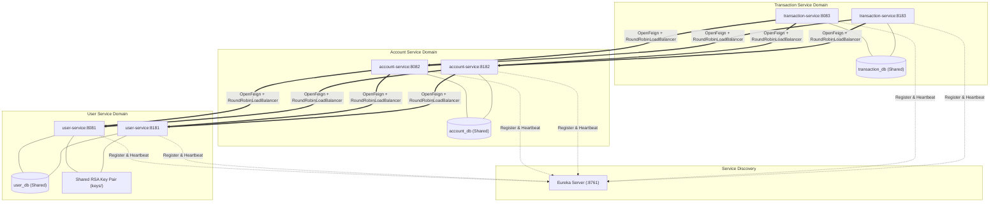
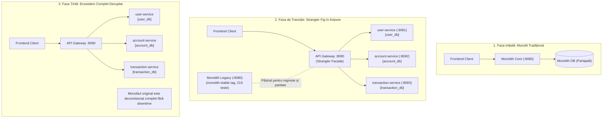

# Microservices Architecture & Scalability Guide

Această documentație descrie arhitectura distribuită a sistemului de Internet Banking, integrând Service Discovery (Eureka Server), Comunicare Declarativă (Spring Cloud OpenFeign) și Distribuție de Încărcare la Nivel de Client (Spring Cloud LoadBalancer).

---

## 1. Topologie și Diagramă de Componente

Sistemul rulează în regim multi-instanță, fiecare serviciu având minim 2 replici active pentru scalabilitate și toleranță la defecte:

```
                            +--------------------+
                            |   Eureka Server    |
                            |    (:8761 / UP)    |
                            +---------+----------+
                                      |
         +----------------------------+----------------------------+
         |                                                         |
         v                                                         v
+------------------+                                      +------------------+
|   USER-SERVICE   |                                      | ACCOUNT-SERVICE  |
|  Replica A: 8081 |                                      |  Replica A: 8082 |
|  Replica B: 8181 |                                      |  Replica B: 8182 |
|                  |                                      |                  |
| Shared RSA Keys  |<--+                                  | Shared DB        |
| Shared user_db   |   |                                  | account_db       |
+------------------+   |                                  +--------+---------+
                       | OpenFeign                                 ^
                       | RoundRobinLoadBalancer                    | OpenFeign
                       +-------------------------------------------+ RoundRobinLoadBalancer
                                                                   |
                                                          +--------+---------+
                                                          | TRANSACTION-SERV |
                                                          |  Replica A: 8083 |
                                                          |  Replica B: 8183 |
                                                          |                  |
                                                          | Shared DB        |
                                                          | transaction_db   |
                                                          +------------------+
```

### Diagramă Mermaid a Fluxurilor și Replicării



---

## 2. Componente Cheie și Mecanisme

### A. Spring Cloud LoadBalancer
- Înlocuiește fostul Ribbon și oferă rutare reactivă/blocantă pe baza instanțelor descoperite prin Eureka (`DiscoveryClientServiceInstanceListSupplier`).
- `RoundRobinLoadBalancer`: distribuie cererile uniform (1:1 alternant) către toate replicile sănătoase.
- Parametru `spring.cloud.loadbalancer.cache.ttl=2s`: permite detectarea retragerii unei instanțe sau adăugării unei instanțe noi în interval de 2 secunde.

### B. Replicabilitatea Cheii RSA și Identitatea Criptografică
- Fiecare instanță de `user-service` emite token-uri JWT semnate cu algoritmul asimetric RS256.
- Pentru ca un token emis de Replică A să fie validat fără probleme de Replică B sau de Resource Serverele `account-service` și `transaction-service`, cheia privată și cheia publică sunt partajate:
  - Calea cheilor: `./keys/private.pem` și `./keys/public.pem`.
  - Inițializare atomică concurențială: generarea utilizează `StandardOpenOption.CREATE_NEW`; dacă o altă replică creează fișierul în același timp (`FileAlreadyExistsException`), procesul concurent preia cheile persistate de pe disk.
  - Ambele replici expun același `kid=user-service-rsa-key-1` la `/.well-known/jwks.json`.

### C. Identificarea Instanțelor și Trasabilitate
- Filtrul HTTP `InstanceIdFilter` injectează antetele:
  - `X-Instance-Id: <service-name>:<port>`
  - `X-Service-Port: <port>`
- Permite clienților și sistemelor de tracing să verifice exact ce replică fizică a servit cererea HTTP.
- Endpoint-ul `/actuator/info` expune numele serviciului, portul și instance ID-ul.

### D. Reziliență și Failover Automat
- La oprirea uneia dintre replicile unui microserviciu (ex: oprirea `account-service:8082`):
  - Eureka detectează lipsa heartbeat-ului (lease expiration duration = 4s).
  - Spring Cloud LoadBalancer actualizează lista de instanțe disponibile.
  - Toate cererile ulterioare sunt direcționate exclusiv către replica rămasă activă (`8182`) fără erori sau dropped requests.

---

## 3. Matricea de Testare și Verificare

| Modul | Teste Java | JaCoCo Acoperire | Rol / Funcționalitate Verificată |
|---|---|---|---|
| **Monolit (`proiect`)** | 219 PASS | 77.16% | Baseline stabil monolit, securitate sesiune, IDOR, Remember Me, CSRF |
| **`eureka-server`** | 1 PASS | 37.50% | Context load, Service Registry pe portul 8761 |
| **`user-service`** | 18 PASS | 77.95% | Emitere JWT RS256, egalitate JWKS între replici, verificare semnătură cross-instanță |
| **`account-service`** | 66 PASS | 75.46% | Resource Server OAuth2, RoundRobinLoadBalancer, Resilience4j CB + Retry, InternalAccountController |
| **`transaction-service`** | 74 PASS | 77.08% | Resource Server OAuth2, transferuri inter-conturi, client Feign către conturi, Resilience4j CB + Retry |
| **`gateway-service`** | 13 PASS | 94.90% | API Gateway reactiv, OAuth2 Resource Server, Rate Limiting (429), CORS, Correlation ID |
| **TOTAL** | **391 PASS** | **> 70% per modul** | **Zero eșecuri, zero erori** |

---

## 4. API Gateway (`gateway-service` :8090)

Modulul `gateway-service` oferă o poartă unică de acces pentru clienți și frontend, implementat folosind **Spring Cloud Gateway WebFlux** pe un stack reactiv non-blocant bazat pe Netty:

```
[ Frontend:5173 / Postman / Clienti ]
                  |
                  v  (HTTP:8090)
       +--------------------+
       |  gateway-service   |
       |  - JWT Validation  |
       |  - Rate Limiting   |
       |  - Centralized CORS|
       |  - Correlation ID  |
       +---------+----------+
                 |
        +--------+--------+
        |  Eureka:8761    |  (Service Discovery: lb://)
        +--------+--------+
                 |
   +-------------+-------------+
   |             |             |
   v             v             v
[user-serv]  [account-serv]  [transaction-serv]
(:8081/:8181) (:8082/:8182)   (:8083/:8183)
```

### Funcționalități Cheie
1. **Rutare Dinamică fără URL-uri hardcodate (`GatewayRoutesConfig`):**
   - Rutele sunt definite utilizând URI-uri `lb://<service-name>`, fiind rezolvate dinamic prin Eureka și distribuite prin Round-Robin Load Balancer.
   - Rutele `/api/admin/**` sunt mapate explicit către serviciul deținător (`lb://user-service` pentru utilizatori, `lb://account-service` pentru conturi și limite).
2. **Securitate Centralizată Reactivă (`SecurityConfig`):**
   - Validează semnătura token-urilor Bearer JWT RS256 folosind setul de chei publice JWKS (`/.well-known/jwks.json`).
   - Respinge cererile neautentificate cu **HTTP 401 Unauthorized** și utilizatorii fără rolul `ADMIN` cu **HTTP 403 Forbidden**.
   - Propagă neschimbat antetul `Authorization: Bearer <token>` către serviciile interne pentru validare defense-in-depth.
3. **Rate Limiting In-Memory (`RateLimiterGatewayFilterFactory`, `InMemoryRateLimiter`):**
   - Algoritm Token Bucket thread-safe configurabil per rută (10 cereri/refill 2s pe login/register; 15 cereri/refill 5s pe plăți).
   - Respinge atacurile brute-force sau suprasolicitarea cu **HTTP 429 Too Many Requests** și antetul `Retry-After`.
4. **Trasabilitate Distribuită (`CorrelationIdGlobalFilter`):**
   - Generează sau propagă `X-Correlation-Id` pe toate cererile și răspunsurile HTTP.
   - Adaugă antetul `X-Gateway-Service: gateway-service` pentru auditabilitate.
5. **CORS Centralizat (`CorsConfig`):**
   - Configurează antetele CORS pentru originea frontend Vite `http://localhost:5173` cu suport complet pentru credențiale și antete expuse.

---

## 5. Reziliență și Toleranță la Erori (Resilience4j)

Pentru a preveni propagarea în cascadă a erorilor și blocarea firelor de execuție, s-a implementat protecția completă prin **Resilience4j** pe ambele relații inter-servicii:
- **Relația A:** `account-service` -> `user-service` (`userServiceCircuitBreaker` + `userServiceRetry`)
- **Relația B:** `transaction-service` -> `account-service` (`accountServiceCircuitBreaker` + `accountServiceRetry`)

### Mașina de Stări a Circuit Breaker-ului

```
       +---------+
       | CLOSED  | <------------------------------------+
       +----+----+                                      |
            |                                           |
            | (5 eșecuri consecutive >= 50% threshold)   | (Toate apelurile de probă
            v                                           |  reușesc)
       +----+----+                                      |
       |  OPEN   |                                      |
       +----+----+                                      |
            |                                           |
            | (Trecere după waitDurationInOpenState=10s)|
            v                                           |
       +----+----+                                      |
       |HALF_OPEN+--------------------------------------+
       +----+----+
            |
            | (Apel de probă eșuat)
            +---------------------> [ Revine în OPEN ]
```

### Configurații și Garanții de Siguranță
1. **Aspect Order Configurat:** `circuitBreakerAspectOrder=1` (outer) și `retryAspectOrder=2` (inner). În starea `OPEN`, apelul eșuează instantaneu (Fail-Fast < 15ms) fără a rula Retry.
2. **Retry pe Citiri Idempotente:** `max-attempts=3`, `wait-duration=500ms` aplicat strict pe căutări de utilizator, conturi și verificări de drepturi.
3. **INVARIANT DE SIGURANȚĂ FINANCIARĂ:**
   - Metodele `debit()`, `credit()` și inițierea de plăți **NU AU RETRY AUTOMAT**.
   - Se garantează că niciun debit nu este executat de două ori din cauza unui timeout de rețea.
4. **Răspuns Fallback Standardizat HTTP 503:**
   - Când serviciul aval este căzut sau circuitul este `OPEN`, se returnează imediat un răspuns standardizat JSON cu status HTTP 503 și `correlationId`.
   - Gateway-ul (8090) transmite răspunsul 503 către client fără alterare.
5. **Actuator Monitoring:**
   - Expunere `/actuator/circuitbreakers`, `/actuator/circuitbreakerevents`, `/actuator/retries`, `/actuator/retryevents`.

Scriptul de verificare live a rezilienței cu 7 procese: `python verify_phase7_resilience.py`.
Scriptul de regresie completă a tuturor modulelor: `python run_full_regression.py`.

---

## 6. Design Pattern: Strangler Fig (Arhitectură de Migrare Incrementală)

Proiectul implementează în mod formal **Strangler Fig Pattern** (conceptualizat de Martin Fowler) ca strategie de transformare arhitecturală de la un monolit stabil către un ecosistem decuplat de microservicii.

### 6.1. Problema și Contextul
- **Aplicația inițială:** A fost dezvoltată și verificată ca o aplicație monolitică exhaustivă cu 12 entități JPA, securitate bazată pe sesiune DB, CSRF, Remember Me, protecție IDOR și 219 teste Java PASS.
- **Riscul unei rescrieri "Big-Bang":** Rescrierea simultană a întregului sistem distribuit ar fi generat riscuri operaționale inacceptabile: perioade lungi în care sistemul este inutilizabil, regresii ascunse și greu de depanat, cuplaj temporal mare și imposibilitatea de a valida incremental serviciile în producție.

### 6.2. Soluția Implementată (Strangler Fig)
1. **Păstrarea Monolitului Activ:** Monolitul a fost conservat neatins și complet funcțional sub eticheta de referință git `monolith-stable` (`76647b8`), garantând paritatea funcțională și rollback-ul instantaneu la nevoie.
2. **Extragerea Incrementală a Bounded Contexts:**
   - **Pasul 1:** `user-service` (:8081/:8181) — extras primul (gestiune utilizatori, profiluri, autentificare JWT RS256, JWKS public). Baza de date dedicată: `user_db`.
   - **Pasul 2:** `account-service` (:8082/:8182) — extras ulterior (conturi, acces conturi, carduri, limite, audit), integrând comunicare declarativă OpenFeign către `user-service`. Baza de date dedicată: `account_db`.
   - **Pasul 3:** `transaction-service` (:8083/:8183) — extras ulterior (tranzacții, transferuri, plăți programate, schimb valutar, categorii, tag-uri), comunicând via OpenFeign cu `account-service`. Baza de date dedicată: `transaction_db`.
3. **Introducerea Strangler Facade (API Gateway):**
   - Modulul `gateway-service` (:8090) funcționează ca fațadă unică în fața sistemului, interceptând tot traficul extern și rutându-l transparent către serviciile noi via Service Discovery (`lb://`).
   - Clienții externi și frontend-ul consumă exclusiv noul punct de intrare unificat, fără a fi conștienți de arhitectura internă sau de retragerea treptată a monolitului.

### 6.3. Diagrame Arhitecturale (Tranziție Strangler Fig)

#### Diagramă Mermaid



### 6.4. Dovezi Concrete din Repository
- **Tag git `monolith-stable` (`76647b8`):** Marchează starea de referință stabilă a monolitului, fără componente de microservicii.
- **219 teste Java Monolit PASS:** Suita originală a monolitului este executată și trece integral la fiecare rulare a regresiei (`run_full_regression.py`).
- **Independență Deplină per Microserviciu:** Fiecare microserviciu deține propriul `build.gradle`, schema de date proprie (`user_db`, `account_db`, `transaction_db`) și suita proprie de teste unitare/integrare.
- **Istoric Git Etapizat:**
  - `76647b8`: `monolith-stable` (baseline monolit)
  - `a04782a` & `e1eb02a`: Extragere `user-service`
  - `26603d1` & `8d48491`: Extragere `account-service`
  - `ba2a01e`: Extragere `transaction-service`
  - `d5df06e`: Integrare Eureka Server + OpenFeign
  - `ca9689d`: Replicare multi-instanță și Load Balancing
  - `b6e72a3`: Creare `gateway-service` (Strangler Facade)
  - `3ff8a8c`: Reziliență Resilience4j (Circuit Breaker & Fallback 503)
- **Zero Ștergere Prematură:** Codul monolitului a fost păstrat intact în directorul rădăcină (`src/main/java`), demonstrând coexistența în siguranță pe parcursul migrației.

### 6.5. Justificare Tehnică
- **Risc Redus:** Fiecare Bounded Context a fost izolat, implementat și validat independent înainte de a trece la următorul.
- **Regresii Imediat Detectabile:** Orice incompatibilitate a putut fi izolată la nivelul contractului de comunicare inter-servicii, fără a afecta funcționarea monolitului.
- **Rollback Imediat:** În cazul unui eșec în producție, traficul poate fi comutat înapoi instantaneu către endpoint-urile monolitului.
- **Validare de Paritate:** Datele și fluxurile financiare din microservicii pot fi comparate direct cu logica de referință din monolit.

### 6.6. Trade-Offs (Compromisuri Identificate)
- **Duplicare Temporară de Cod:** Entități, DTO-uri și servicii de utilitate coexistă atât în monolit, cât și în microserviciile extrase pe durata migrației.
- **Dublă Paradigma de Securitate:** Monolitul utilizează autentificare bazată pe sesiune DB cu cookie-uri CSRF, în timp ce microserviciile utilizează arhitectură stateless cu token-uri JWT RS256 validate prin JWKS public.
- **Complexitate Operațională Temporară:** Rularea concurentă a instanțelor pe porturi multiple (8761, 8090, 8081, 8181, 8082, 8182, 8083, 8183) pe durata fazelor de dezvoltare și testare live.
- **Sincronizarea Contractelor API:** Necesitatea de a asigura paritatea schemelor de răspuns (DTO-uri, coduri de eroare REST) între monolit și microservicii.


