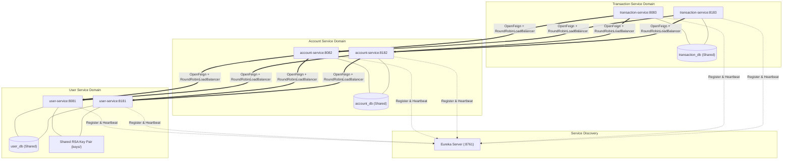

# Microservices Architecture & Scalability Guide

Această documentație descrie arhitectura distribuită a sistemului de Internet Banking, integrând Service Discovery (Eureka Server), Comunicare Declarativă (Spring Cloud OpenFeign) și Distribuție de Încărcare la Nivel de Client (Spring Cloud LoadBalancer).

---

## 1. Topologie și Diagramă de Componente

Sistemul rulează în regim multi-instanță, fiecare serviciu având minim 2 replici active pentru scalabilitate și toleranță la defecte:

```
                            +--------------------+
                            |   Eureka Server    |
                            |    (:8761 / UP)    |
                            +---------+----------+
                                      |
         +----------------------------+----------------------------+
         |                                                         |
         v                                                         v
+------------------+                                      +------------------+
|   USER-SERVICE   |                                      | ACCOUNT-SERVICE  |
|  Replica A: 8081 |                                      |  Replica A: 8082 |
|  Replica B: 8181 |                                      |  Replica B: 8182 |
|                  |                                      |                  |
| Shared RSA Keys  |<--+                                  | Shared DB        |
| Shared user_db   |   |                                  | account_db       |
+------------------+   |                                  +--------+---------+
                       | OpenFeign                                 ^
                       | RoundRobinLoadBalancer                    | OpenFeign
                       +-------------------------------------------+ RoundRobinLoadBalancer
                                                                   |
                                                          +--------+---------+
                                                          | TRANSACTION-SERV |
                                                          |  Replica A: 8083 |
                                                          |  Replica B: 8183 |
                                                          |                  |
                                                          | Shared DB        |
                                                          | transaction_db   |
                                                          +------------------+
```

### Diagramă Mermaid a Fluxurilor și Replicării



---

## 2. Componente Cheie și Mecanisme

### A. Spring Cloud LoadBalancer
- Înlocuiește fostul Ribbon și oferă rutare reactivă/blocantă pe baza instanțelor descoperite prin Eureka (`DiscoveryClientServiceInstanceListSupplier`).
- `RoundRobinLoadBalancer`: distribuie cererile uniform (1:1 alternant) către toate replicile sănătoase.
- Parametru `spring.cloud.loadbalancer.cache.ttl=2s`: permite detectarea retragerii unei instanțe sau adăugării unei instanțe noi în interval de 2 secunde.

### B. Replicabilitatea Cheii RSA și Identitatea Criptografică
- Fiecare instanță de `user-service` emite token-uri JWT semnate cu algoritmul asimetric RS256.
- Pentru ca un token emis de Replică A să fie validat fără probleme de Replică B sau de Resource Serverele `account-service` și `transaction-service`, cheia privată și cheia publică sunt partajate:
  - Calea cheilor: `./keys/private.pem` și `./keys/public.pem`.
  - Inițializare atomică concurențială: generarea utilizează `StandardOpenOption.CREATE_NEW`; dacă o altă replică creează fișierul în același timp (`FileAlreadyExistsException`), procesul concurent preia cheile persistate de pe disk.
  - Ambele replici expun același `kid=user-service-rsa-key-1` la `/.well-known/jwks.json`.

### C. Identificarea Instanțelor și Trasabilitate
- Filtrul HTTP `InstanceIdFilter` injectează antetele:
  - `X-Instance-Id: <service-name>:<port>`
  - `X-Service-Port: <port>`
- Permite clienților și sistemelor de tracing să verifice exact ce replică fizică a servit cererea HTTP.
- Endpoint-ul `/actuator/info` expune numele serviciului, portul și instance ID-ul.

### D. Reziliență și Failover Automat
- La oprirea uneia dintre replicile unui microserviciu (ex: oprirea `account-service:8082`):
  - Eureka detectează lipsa heartbeat-ului (lease expiration duration = 4s).
  - Spring Cloud LoadBalancer actualizează lista de instanțe disponibile.
  - Toate cererile ulterioare sunt direcționate exclusiv către replica rămasă activă (`8182`) fără erori sau dropped requests.

---

## 3. Matricea de Testare și Verificare

| Modul | Teste Java | JaCoCo Acoperire | Rol / Funcționalitate Verificată |
|---|---|---|---|
| **Monolit (`proiect`)** | 219 PASS | 77.16% | Baseline stabil monolit, securitate sesiune, IDOR, Remember Me, CSRF |
| **`eureka-server`** | 1 PASS | 37.50% | Context load, Service Registry pe portul 8761 |
| **`user-service`** | 18 PASS | 77.95% | Emitere JWT RS256, egalitate JWKS între replici, verificare semnătură cross-instanță |
| **`account-service`** | 58 PASS | 73.44% | Resource Server OAuth2, RoundRobinLoadBalancer test, InternalAccountController, InstanceIdFilter |
| **`transaction-service`** | 65 PASS | 75.67% | Resource Server OAuth2, transferuri inter-conturi, client Feign către conturi, LoadBalancer test |
| **TOTAL** | **361 PASS** | **> 70% per modul** | **Zero eșecuri, zero erori** |

Scriptul de verificare live completă: `scratch/verify_phase5_load_balancing.py`.
